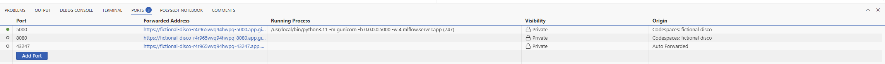

# ARISA-MLOps
## Prerequisites  
Install python 3.11 with py manager on your local machine.  
Install Visual Studio Code on your local machine.  
Create a kaggle account and create a kaggle api key kaggle.json file.  
Move the kaggle.json to   
C:\Users\USERNAME\\.kaggle folder for windows,  
/home/username/.config/kaggle folder for mac or linux.  
### Local
Fork repo to your own github account.  
Clone forked repo to your local machine.  
Open VS Code and open the repo directory.  
In the VS Code terminal run the following to create a new python virtual environment:  
```
py -3.11 -m venv .venv
```
windows
```
.\.venv\Scripts\activate
```
mac or linux  
```
source .venv/bin/activate
```
and then open up notebook 02 and attempt to run the cells.  

### Github Codespaces  
Fork repo to your own github account.  
Click the code button, select codespaces tab click create codespace on main.  
Copy your kaggle.json to the root dir of the repo (do not commit it, it should be in .gitignore)  
Optionally, after the codespace has finished loading click the blue button on the bottom left and select open in visual studio code.  
Make sure to turn off the codepace when done, you have a limited amount of free runtime hours.  

## MLOps Architecture
The repo code implements the general MLOps architecture in the below diagram:

(source https://ml-ops.org/content/mlops-principles)
More specifically, an MLflow tracking server is hosted in a Codespace,
and running the two pipelines in GitHub Actions Workflows, see architecture below:


### Getting the architecture up and running
Since we will be using AWS S3 to host the MLflow artifact store we will neeed to set this up in AWS.  
Set up a new AWS account if you don't have one already (and enable MFA!).  
It could also be possible to set up the artifact store to save and read from google drive, but this has not been tested.  
#### Metadata store database
The devcontainer.json is set up to save the metadata store db file to the local codespaces filesystem, which should be enough to run the MLFlow instance
#### Artifact store
Navigate to S3  
Create bucket  
Leave all settings at their default values  
Give a globally unique name to the bucket and keep it for later  
Create bucket  
#### Authenticate
Navigate to IAM  
Click Users  
Create user  
Enter a User name, something like github-actions-runner  
Next  
Under Set permissions choose Attach policies directly  
Under Permissions policies add AmazonS3FullAccess  
Next  
Review and create -> Create user  
Click the newly created user  
Go to Security credentials  
Click Create access key  
Choose Application running outside AWS  
Next  
Optionally add a description  
Click Create access key  
Copy both the Access key and Secret access key (do not share these with anyone or commit them to any repo!)  

#### GitHub Secrets setup
You should now have the following pieces of information:  
 * Access key (from the github-actions-runner user security credentials)  
 * Secret access key (from the github-actions-runner user security credentials)  
 * MLflow tracking URI (Codespaces Instance URI)  
 * Kaggle key (contents of kaggle.json, from earlier sessions or create a new one)
 * S3 bucket name

Add all of these to your repository's Codespaces secrets with the names:  
 * AWS_ACCESS_KEY_ID
 * AWS_SECRET_ACCESS_KEY
 * MLFLOW_TRACKING_URI
 * KAGGLE_KEY
 * ARTIFACT_BUCKET

Also add the following to your repository's Actions secrets:
 * AWS_ACCESS_KEY_ID
 * AWS_SECRET_ACCESS_KEY
 * KAGGLE_KEY
 * ARTIFACT_BUCKET

#### Code and codespaces setup 
Now make sure your version/fork of the repo is up to date with the current state of the master branch of this repo  
Especially make sure that the following commands are part of your .devcontainer.json:
```
	"postCreateCommand": "pip install --no-cache-dir mlflow==2.12.1 psycopg2 boto3",
	"postStartCommand": "mkdir -p /home/vscode/mlflow/artifacts & mlflow ui --backend-store-uri sqlite:////home/vscode/mlflow/mlflow.db --default-artifact-root s3://${ARTIFACT_BUCKET}/models --host 0.0.0.0 --port 5000",
```
as well as remoteEnv containing the Codespaces secrets (see main branch version)  
Then start a new codespace with the update version of the code  
Once connected to the codespace click the ports tabs and copy the codespace address (this is the MLFLOW_TRACKING_URI) and make sure to change visibility to public, and that the Running Process shows the mlflow server app like in the picture below.  

Back in actions secrets add a new secret containing the address with name MLFLOW_TRACKING_URI  
When MLFlow UI has started run the model training a couple of times and see the experiments update in the UI  
Freeze requirements using `pip freeze --local > requirements.txt` and make sure psycopg2 boto3 and kaggle appears in the requirements.txt file, if not install them manually  
Finally make a change to the train.py code (can be as simple as a comment) and commit (directly to main is fine for this task)  
A retrain pipeline should be started and hopefully success in the actions tab  
After the retrain pipeline finished it should trigger the predict on model change pipeline  
See how the models tab in the MLFlow UI has changed  
Change something else in train.py, commit to main and see how the models page update again after both pipelines have run.

**If the mlflow ui does not successfully start click the blue button at the bottom left of the codespaces view and click view creation log for any errors.**


